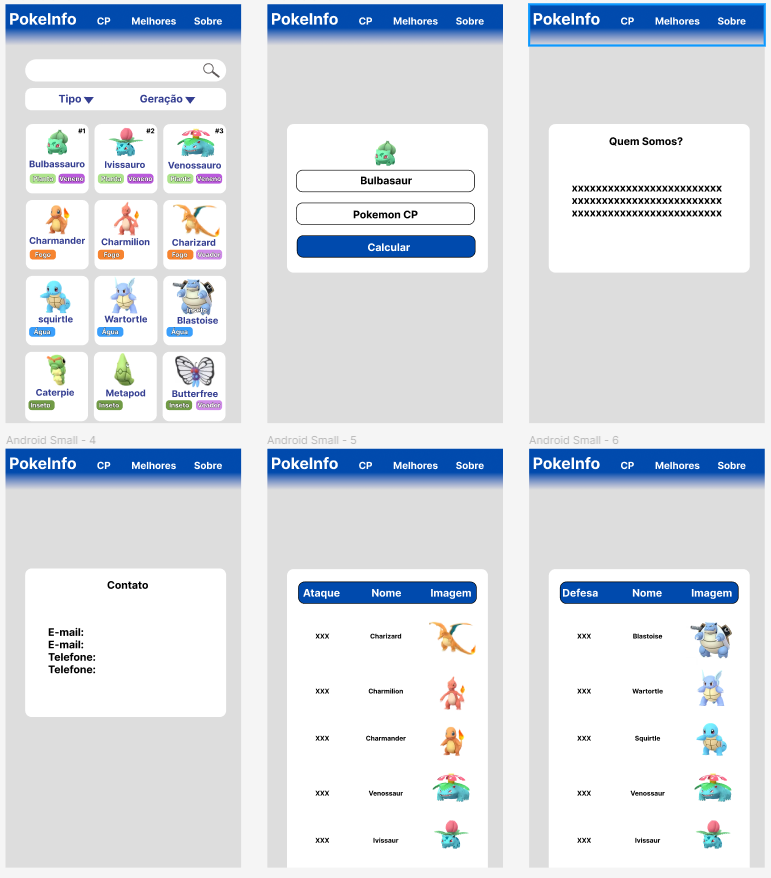

# PokeInfo - Data Lovers

## Índice

* [1. Introdução](#1-introdução)
* [2. Objetivos de aprendizagem](#2-objetivos-de-aprendizagem)
* [3. Demonstração](#3-demonstração)
* [4. Considerações finais](#4-considerações-finais)

***
## 1. Introdução

Neste projeto proposto pela **Laboratoria**, construimos uma _página web_ para visualizar um conjunto
(set) de dados que se adeque às necessidades do nosso usuário. Como itens excenciais era necessário 
uma página web que permita visualizar dados, filtrá-los, ordená-los e fazer algum cálculo agregado. 

Definimos nossa área de interesse diante dos temas propostos e procuramos entender quem seria nosso
usuário e o que exatamente ele necessitaria saber ou ver, para assim conseguir construir uma interface
 que o ajude a interagir e entender melhor os dados.

Este foi nosso "dado" escolhido:

* [Pokémon](src/data/pokemon/pokemon.json): Neste conjunto encontramos uma
  lista com os 251 Pokémons que compreendem a região de Kanto e Johto, com suas respectivas estatísticas
  utilizadas no jogo [Pokémon GO](http://pokemongolive.com).

O objetivo principal deste projeto foi  aprender a desenhar e construir uma
interface web onde se possa visualizar e manipular dados, entendendo o que o
usuário necessita.

## 2. Objetivos de aprendizagem

Neste projeto tinhamos objetivos de aprendisagem claros, que foram acordados mediante dialogos ou necessidades para o andamento do projeto.
Esses objetivos estão listados a seguir:

- [ ] **Uso de HTML semântico**

- [ ] **Uso de seletores de CSS**

- [ ] **Empregar o modelo de caixa (box model): borda, margem, preenchimento**

- [ ] **Uso de flexbox em CSS**

- [ ] **Uso de seletores de DOM**

- [ ] **Manipulação de eventos de DOM**

- [ ] **Manipulação dinâmica de DOM**

- [ ] **Diferenciar entre tipos de dados primitivos e não primitivos**

- [ ] **Manipular arrays (filter, map, sort, reduce)**

- [ ] **Manipular objects (key | value)**

- [ ] **Variáveis (declaração, atribuição, escopo)**

- [ ] **Uso de condicionais (if-else, switch, operador ternário)**

- [ ] **Uso de laços (for, for..of, while)**

- [ ] **Uso de funções (parâmetros, argumentos, valor de retorno)**

- [ ] **Testes unitários**

- [ ] **Módulos de ECMAScript (ES modules)**

- [ ] **Uso de linter (ESLINT)**

- [ ] **Uso de identificadores descritivos (Nomenclatura | Semântica)**

- [ ] **Diferença entre expression e statements**

- [ ] **Git: Instalação e configuração**

- [ ] **Git: Controle de versão com git (init, clone, add, commit, status, push, pull, remote)**

- [ ] **Git: Integração de mudanças entre ramos (branch, checkout, fetch, merge, reset, rebase, tag)**

- [ ] **GitHub: Criação de contas e repositórios, configuração de chave SSH**

- [ ] **GitHub: Implantação com GitHub Pages**

- [ ] **GitHub: Colaboração pelo Github (branches | forks | pull requests | code review | tags)**

- [ ] **Desenhar a aplicação pensando e entendendo a usuária**

- [ ] **Criar protótipos para obter feedback e iterar**

- [ ] **Aplicar os princípios de desenho visual (contraste, alinhamento, hierarquia)**

- [ ] **Planejar e executar testes de usabilidade**

## 3. Demonstração

Para a excução correta do projeto, planejamos um protótimo capaz de suprir as necessidades de nosso 
publico alvo. Partindo de nossas histórias de usuario.
1- Eu como jogador profissional de pokemon go, quero algo capaz de me fronecer os tipos de pokemon para facilitar minha escolha na hora de capturar um pokemon.
2- Eu como um menino curioso, quero poder vizualizar vários pokémons de uma vez para conhecer mais espécies 

Uma vez tendo essa referência seguimos para o desenvolvimento de dois protótipos. Um voltado para desktop e outro
para mobile.

## 4. Considerações finais

Este projeto serviu para expandir nosso saber, através de prática e pesquisa, e desenvolver certos conhecimentos. 
O produto visa facilitar a vida de usuários mediante suas necessidades. Procuramos por meio deste atentender da melhor maneira possível nosso usuário.

